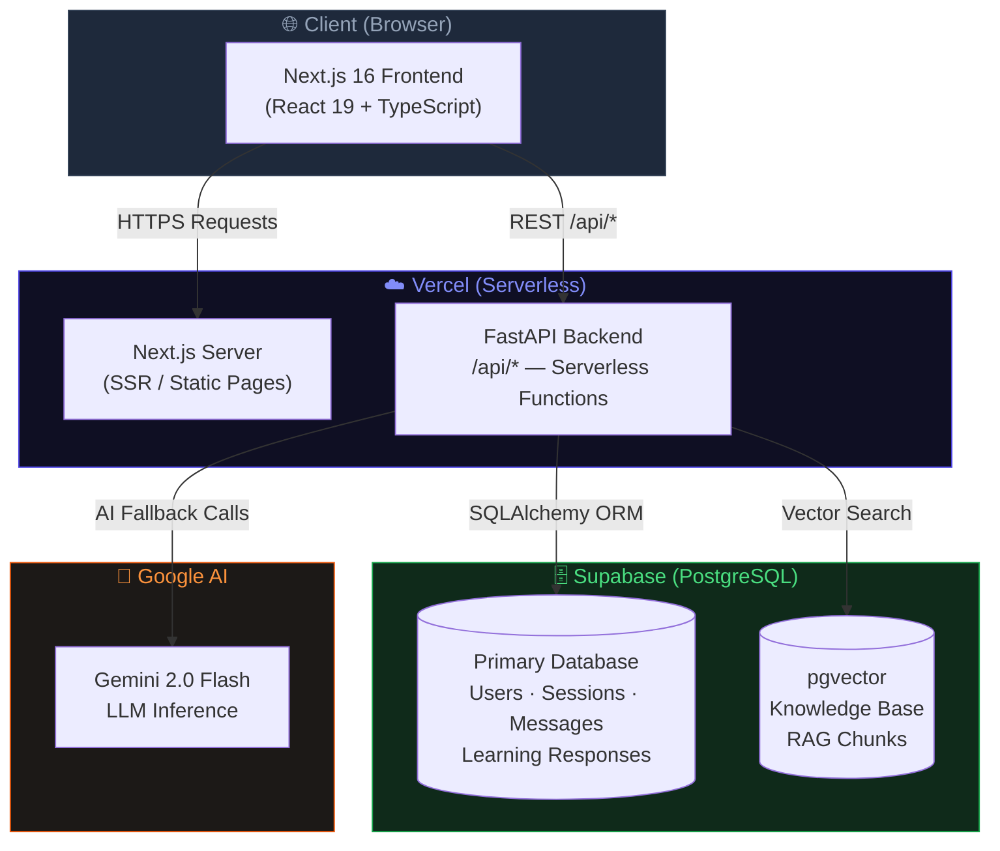
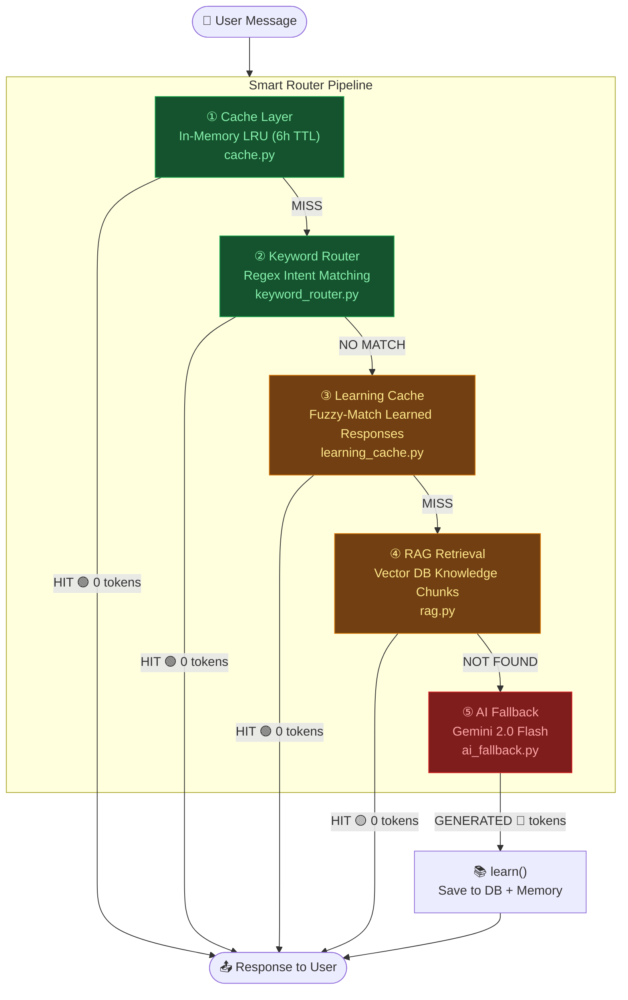
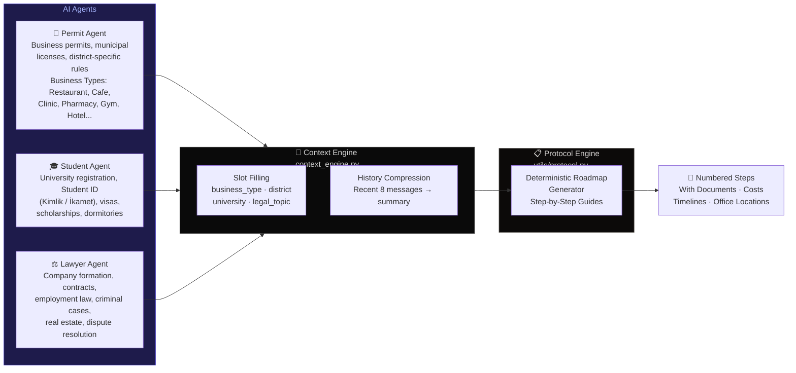
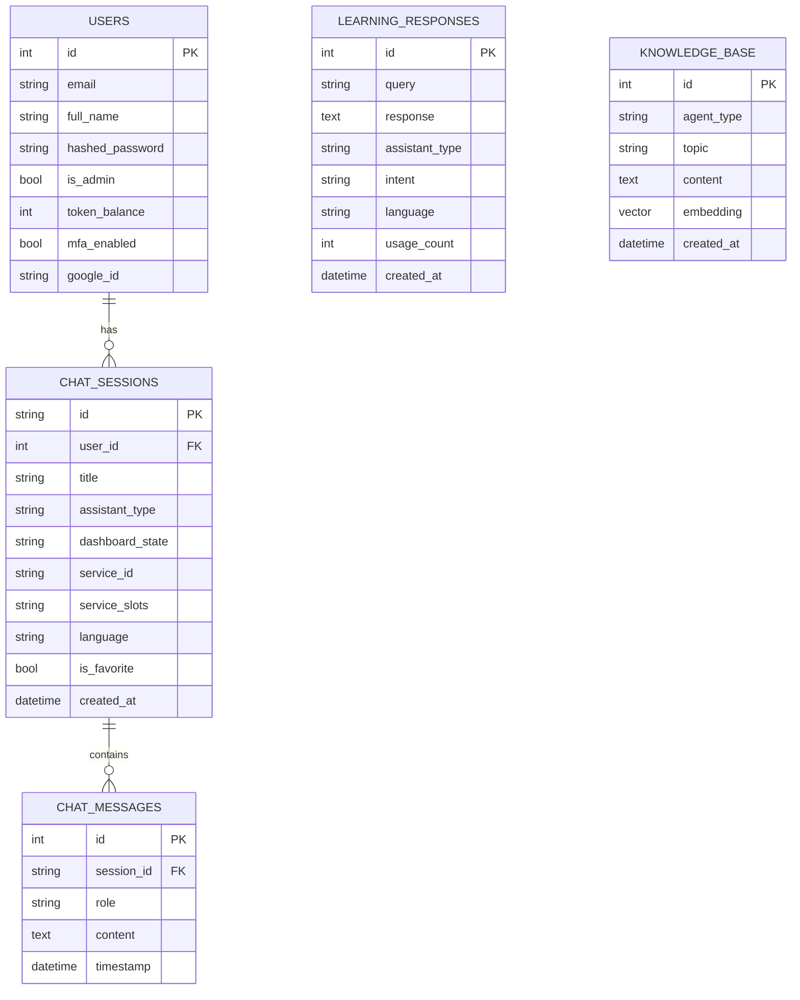
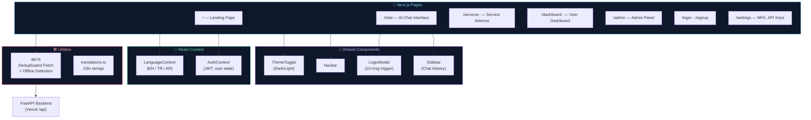
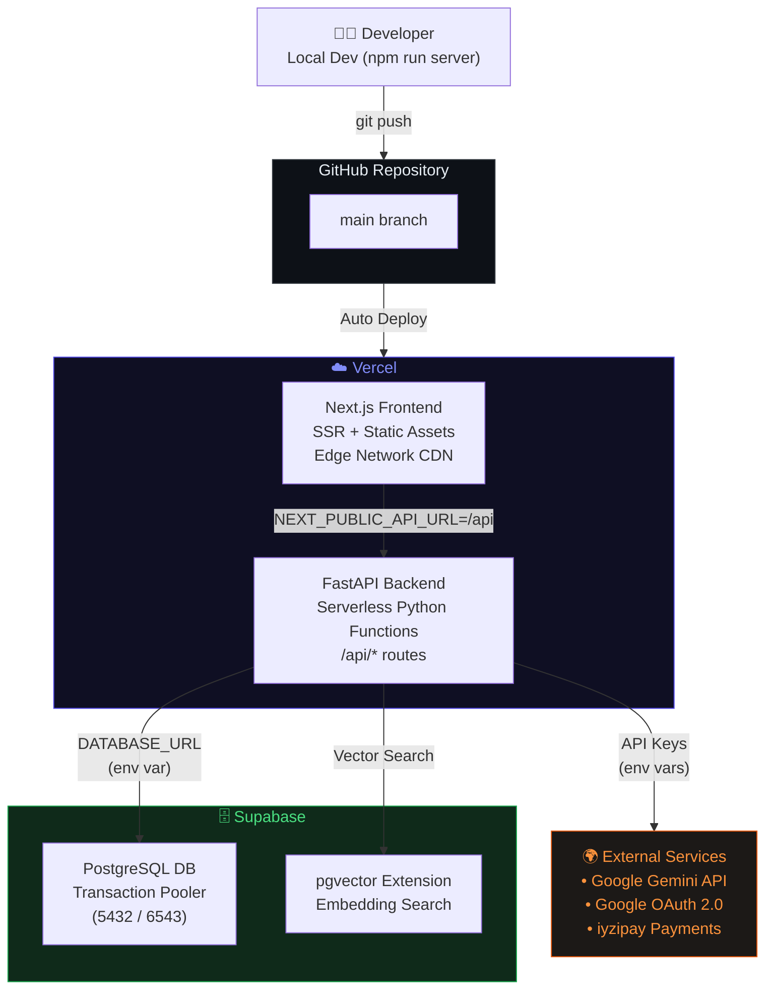
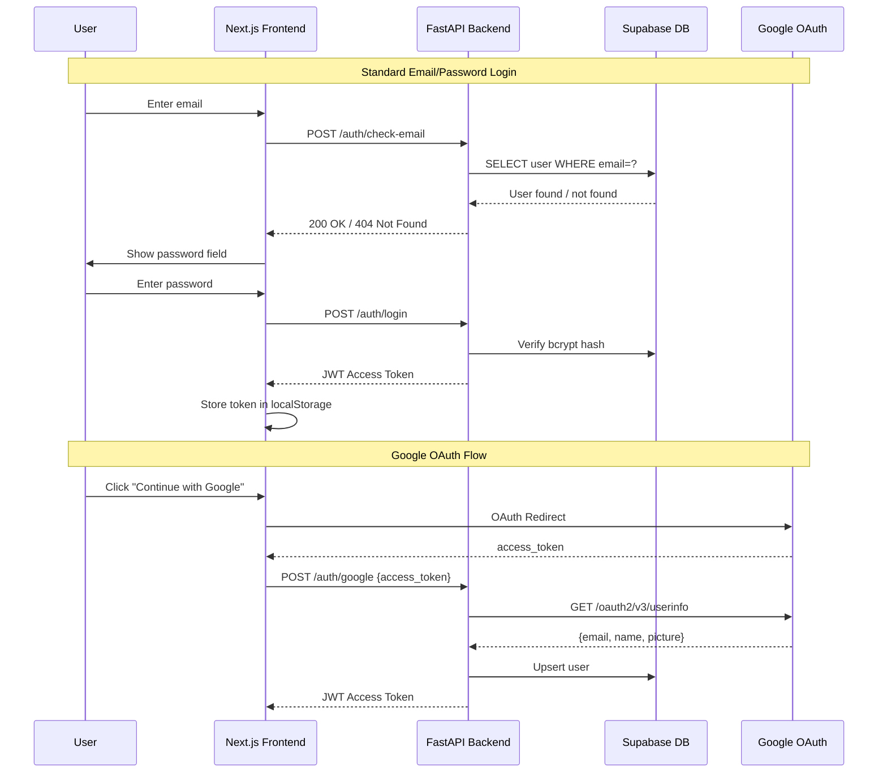

# 🏗️ TurkGateWay — System Architecture

> A cloud-native, AI-powered guidance platform for navigating Turkish bureaucracy. Built with Next.js 16, FastAPI, and deployed on Vercel + Supabase (PostgreSQL).

---

## 📐 High-Level Overview



---

## 🧠 Backend Architecture — Smart Router Pipeline

Every user message passes through a **4-layer cost-optimization pipeline** before ever touching the AI.



---

## 🤖 Agent System

Three specialized AI agents, each with a domain-specific knowledge library and roadmap generator.



---

## 🗄️ Database Schema



---

## 🌐 Frontend Architecture



---

## 🚀 Deployment Architecture



---

## 🔐 Authentication Flow



---

## 📦 Tech Stack

| Layer | Technology | Purpose |
|---|---|---|
| **Frontend** | Next.js 16.1.6 + React 19 | SSR, routing, UI |
| **Styling** | Vanilla CSS + CSS Variables | Dark/Light theming |
| **Animations** | Framer Motion | Micro-animations |
| **Backend** | FastAPI (Python 3.11+) | REST API, agent orchestration |
| **AI Models** | Google Gemini 2.0 Flash | LLM inference |
| **AI Framework** | Pydantic-AI + LangGraph | Agent workflows |
| **Database ORM** | SQLAlchemy 2.0 | DB abstraction |
| **Database** | PostgreSQL (Supabase) | Primary data store |
| **Vector Search** | pgvector | RAG knowledge retrieval |
| **Auth** | JWT (PyJWT) + bcrypt | Stateless auth + password hashing |
| **OAuth** | Google OAuth 2.0 | Social login |
| **Payments** | iyzipay | Token billing |
| **Rate Limiting** | SlowAPI | API abuse prevention |
| **Hosting** | Vercel | Frontend + serverless backend |
| **Language** | TypeScript + Python | Type-safe full-stack |

---

## 🗂️ Monorepo Structure

```
turkgateway/
├── src/app/                    # Next.js frontend (App Router)
│   ├── chat/                   # Main AI chat interface
│   ├── services/               # Service selector page
│   ├── dashboard/              # User dashboard
│   ├── admin/                  # Admin panel
│   ├── components/             # Shared UI components
│   │   ├── Navbar.tsx
│   │   ├── Sidebar.tsx
│   │   ├── LoginModal.tsx
│   │   └── ThemeToggle.tsx
│   ├── context/                # React Context providers
│   │   ├── AuthContext.tsx
│   │   └── LanguageContext.tsx
│   └── utils/
│       ├── api.ts              # Deduplicated fetch + offline detection
│       └── translations.ts     # i18n (EN / TR / AR)
│
├── backend/                    # FastAPI backend
│   ├── main.py                 # App entry point + all API routes
│   ├── database.py             # SQLAlchemy engine (SQLite → PostgreSQL)
│   ├── models/                 # ORM models
│   │   ├── user.py
│   │   ├── chat.py             # ChatSession, ChatMessage, LearningResponse
│   │   ├── knowledge_base.py
│   │   └── schemas.py
│   ├── agents/                 # Agent knowledge libraries
│   │   ├── permit/             # responses.json + learned/
│   │   ├── student/            # responses.json + learned/
│   │   ├── lawyer/             # responses.json + learned/
│   │   └── general/            # Greetings, identity responses
│   ├── smart_router/           # 5-layer intelligence pipeline
│   │   ├── __init__.py         # Main router orchestrator
│   │   ├── keyword_router.py   # Regex intent detection (0 tokens)
│   │   ├── cache.py            # In-memory LRU response cache
│   │   ├── learning_cache.py   # AI response persistence + fuzzy retrieval
│   │   ├── context_engine.py   # Session state, slot filling, history
│   │   ├── ai_fallback.py      # Gemini API calls (last resort)
│   │   ├── rag.py              # Vector similarity search
│   │   └── template_engine.py  # Response template rendering
│   └── utils/
│       └── protocol.py         # Deterministic roadmap step builders
│
├── api/
│   └── index.py                # Vercel serverless entrypoint
│
├── vercel.json                 # Vercel routing config
├── requirements.txt            # Python dependencies
└── package.json                # Node dependencies
```

---

## ⚡ Key Design Decisions

| Decision | Rationale |
|---|---|
| **Serverless (Vercel)** | Zero-cost scaling, no CPU instance needed, ephemeral execution |
| **PostgreSQL (Supabase)** | Replaces SQLite for data persistence across serverless invocations |
| **5-Layer Smart Router** | Aggressively reduces Gemini API token costs — most queries answered from cache/keywords |
| **Learning Cache → DB** | AI responses are saved to PostgreSQL so they survive Vercel's read-only filesystem |
| **File writes disabled on Vercel** | `VERCEL` env var gates all local JSON writes to prevent runtime errors |
| **Monorepo** | Frontend + Backend in one repo for unified deployment on Vercel |
| **Deterministic Roadmaps** | `protocol.py` generates step-by-step guides without LLM calls for known service types |
| **i18n (EN/TR/AR)** | Supports English, Turkish, and Arabic for Istanbul's international user base |
