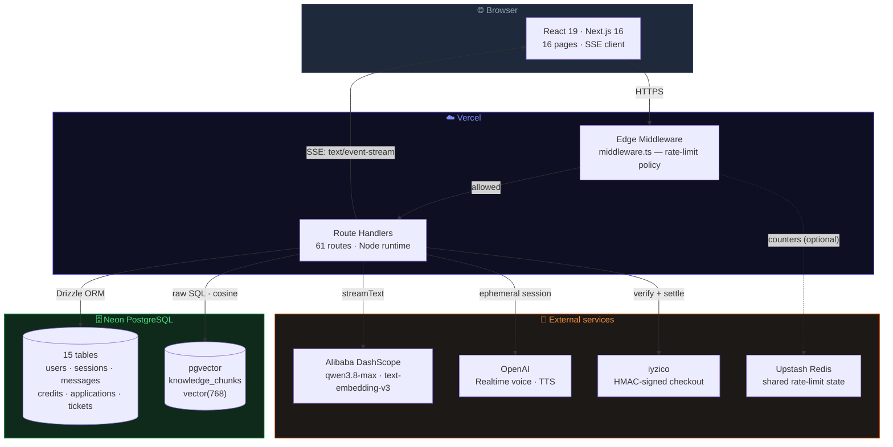
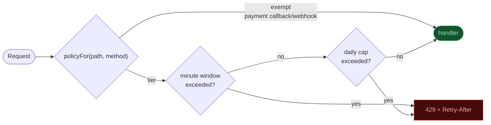
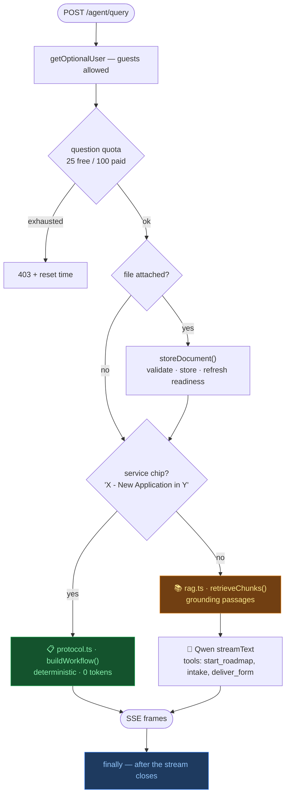
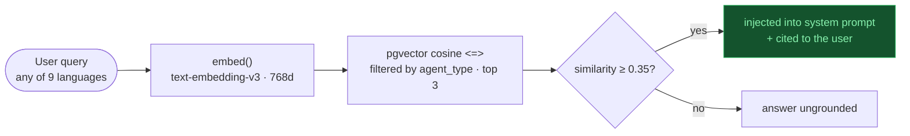
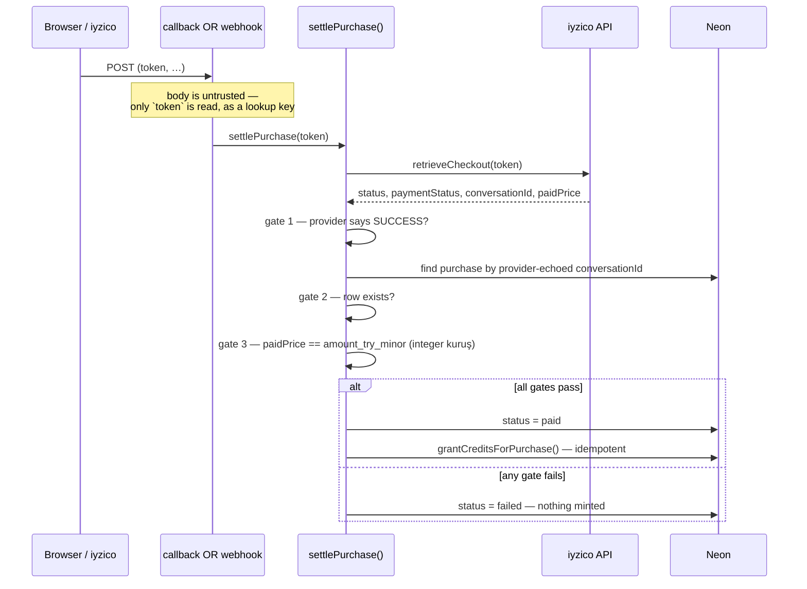
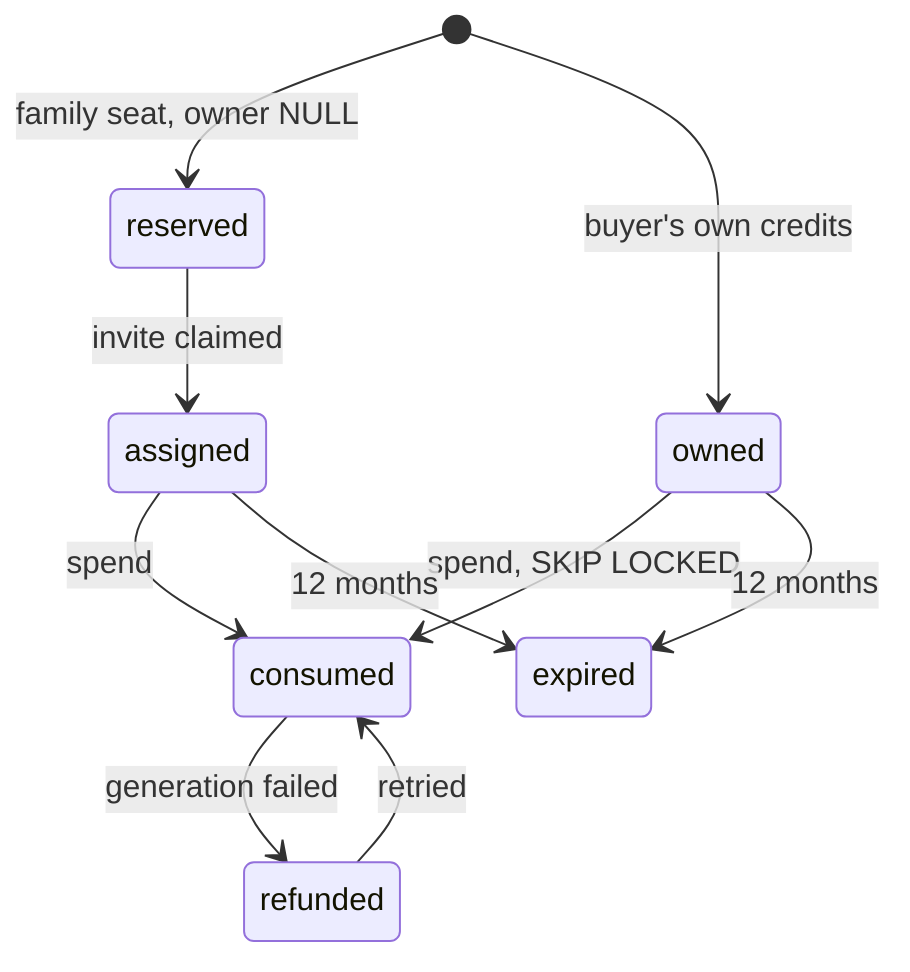
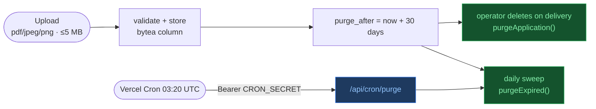
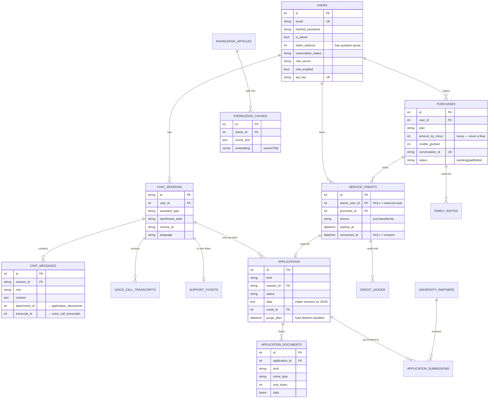
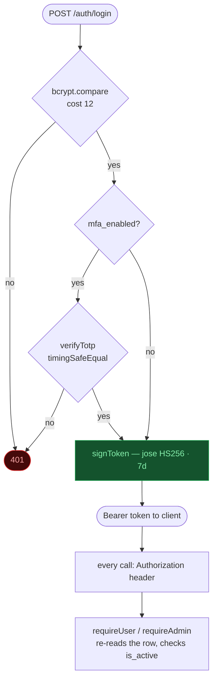

# 🏗️ TurkGateWay — System Architecture

> An AI-guided platform for navigating Turkish bureaucracy — visa appointments,
> residence permits, university placement, SGK insurance and business licences.
> Next.js 16 (App Router) end to end, Qwen via Alibaba DashScope for generation,
> Neon PostgreSQL with pgvector for storage and retrieval, deployed on Vercel.

**Scale:** 33,317 lines of TypeScript · 61 route handlers · 16 pages · 15 tables · 9 languages.

---

## 📐 High-Level Overview

There is no separate backend service. Every server-side concern is a Next.js
route handler running on the Node runtime, with one Edge middleware in front of
all of them.



> **Upstash is optional in code and effectively required in production.** When
> the two `UPSTASH_*` variables are absent, `rate-limit.ts` falls back to a
> per-process in-memory map. Each Vercel instance is its own process, so the
> ceilings become per-instance — see [Known gaps](#-known-gaps).

---

## 🛡️ Rate Limiting — one gate, not fifty-two

Enforcement lives in Edge middleware rather than in each handler. The previous
arrangement had a call in 4 of 52 routes, and the expensive ones were the ones
nobody remembered.



Tiers are sized by what a request **costs to serve**, not by how it feels:

| Tier | Per minute | Per day | Covers |
|---|---:|---:|---|
| `browser` | 3 | 20 | Headless automation runs |
| `vision` | 10 | 60 | Document extraction |
| `llm` | 20 | 300 | `/agent/query`, İkamet automation |
| `auth` | 10 | — | Login, register, MFA verify |
| `authLight` | 30 | — | Session checks |
| `write` | 30 | — | Ordinary mutations |
| `admin` | 60 | — | Admin panel, LLM relay |
| `read` | 120 | — | Cheap reads |
| `poll` | 120 | — | Support queue, automation frames |
| `default` | 60 | — | Anything unmatched |
| *exempt* | ∞ | ∞ | Payment callback + webhook, by design |

Matching is first-wins, ordered most-specific to least. **An unmatched route
falls to `default`, so a route added tomorrow is metered without anyone wiring
it up** — that is the property the table exists to guarantee.

Identity is user id for a signed-in caller (verified with `jose` in the Edge
runtime, no database round trip) and IP otherwise, so sharing an office NAT does
not halve anyone's budget.

---

## 🧠 The hot path — `POST /agent/query`

The only streaming endpoint, and the most expensive. Two routes reach an answer;
both emit the same frame vocabulary, so the client never branches on which one
replied.



### Stream contract

Frames consumed by `src/app/chat/page.tsx`:

| Event | Payload | Meaning |
|---|---|---|
| `meta` | `{ source, token_balance, session_title }` | Sent immediately, before any text |
| `delta` | `{ t }` | A chunk of reply text |
| `dashboard` | `{ state }` | Roadmap ready |
| `visa_intake` | `{ collected, missing, … }` | Intake progress — **field labels only, never answers** |
| `university_intake` · `ikamet_intake` · `insurance_intake` · `business_intake` | same shape | Per-service intake progress |
| `document_checklist` | `{ service, items }` | Free upload checklist |
| `attachment` | `{ filename, url }` | A generated form PDF |
| `confirm_required` | `{ pending }` | Model wants to build a roadmap; no credit spent yet |
| `done` / `error` | `{}` / `{ detail }` | Terminal |

### Charging happens last, on purpose

The question quota is debited and the transcript persisted inside a `finally`,
and only when `fullText` is non-empty. A stream that dies halfway costs the user
nothing. If a **service credit** was spent and the stream then failed, it is
returned via `refundCredit()`.

---

## 📚 Retrieval (RAG)



**Every failure path returns an empty array rather than throwing.** A DashScope
embedding outage costs the answer its citations, never the answer itself.
Concrete Turkish facts (fee ranges, portals, timelines) live in `prompts.ts` as
the knowledge floor, so replies stay grounded even when retrieval returns
nothing.

---

## 💳 Billing — purchases, then credits

Service credits replaced the old subscription binary. **One credit buys one
finalised roadmap.** Chat is unaffected and stays on the free question quota.

### Settlement: two public doors, one locked gate



Both entry points are unauthenticated by necessity: `/payment/callback` is a
redirect the customer's browser lands on, `/payment/webhook` is a server
notification. Neither is believed. Reading a user id out of the posted
`conversationId` once made this a free-money endpoint:

```
curl -X POST /payment/callback -d 'status=success&conversationId=tg-1-1'
```

The amount check is the subtle gate — without reconciling against the purchase
row created *before* checkout, a tampered form could pay ₺1 for a ₺1,750 plan
and clear every other check.

### Credit states

A credit is **one row, not a counter** — each needs its own expiry, provenance
and audit trail, which an integer on `users` cannot express.



**Reserved credits are spendable by nobody.** That is what stops a family-plan
buyer from spending a seat they have already given away. Every transition
appends one row to `credit_ledger`, which is append-only and never updated —
and a ledger write failure is logged but never rolls back a real credit
movement.

Concurrency: `consumeCredit()` is a single conditional `UPDATE` whose sub-select
takes `FOR UPDATE SKIP LOCKED` and whose `WHERE` re-asserts
`consumed_at IS NULL`. Two simultaneous calls with one credit left produce
exactly one winner; the loser updates zero rows and gets `null`, which callers
must treat as a hard stop.

---

## 📄 Applications and document lifecycle

One table for every kind of work the platform takes on, distinguished by `kind`:
`visa_appointment` · `university` · `criminal_case` · `ikamet` · `insurance` ·
`business`. They share conversational intake, uploaded documents, a service
credit and an operator-moved status, so they share a table.



These rows hold **passport-level PII and academic records**, so they are
short-lived by design: `purge_after` bounds how long a row may exist at all,
the operator deletes it outright once the work is delivered, and the daily
sweep is the backstop for anything abandoned mid-intake.

> The sweep route **refuses to run without `CRON_SECRET`** rather than falling
> back to unauthenticated. It deletes rows, so an open version of it is a
> denial-of-service against the applicants' own documents. `/api/health`
> reports whether it is armed.

Documents are kept in their own table rather than as a column on `applications`,
so listing an application never drags file bytes along with it. Downloads join
through to the owning application and answer **404, not 403**, for a foreign row
— the id space leaks nothing to an enumerator.

---

## 🗄️ Database Schema

15 tables. Grouped by concern; foreign keys shown for the relationships that
carry behaviour.



Not drawn, for legibility: `family_invites`, `credit_ledger`,
`voice_call_transcripts`, `support_tickets`, `university_partners`,
`application_submissions`, `knowledge_articles` — all present in
`src/lib/schema.ts` and related as the diagram's edges indicate.

> `embedding` is a native `vector(768)` column created by
> `scripts/setup-pgvector.mjs`. Drizzle has no vector type, so `rag.ts` queries
> it with raw SQL through the Neon template tag — the embedding and agent type
> are **bound parameters**, not interpolated text.

### Migrations

Ordered SQL files in `drizzle/migrations`, applied by `scripts/migrate.mjs`,
which records each one in a `_migrations` table so a second run is a no-op. It
exists because `drizzle-kit push` diffs and rewrites the database to match —
fine for a scratch database, wrong for one holding real applications.

```bash
npm run db:migrate:status   # applied vs pending
npm run db:migrate:dry      # preview, change nothing
npm run db:migrate          # apply
```

---

## 🔐 Authentication



Deliberate choices worth keeping:

- **Bearer header only.** Tokens in query strings leak into proxy logs, browser
  history and referrer headers. The query-param fallback the legacy backend used
  is gone.
- **Production hard-fails without `JWT_SECRET`.** Falling back to a public
  constant would let anyone forge tokens, including admin ones. Development
  keeps a loud fallback so local startup stays frictionless.
- **TOTP is dependency-free** (RFC 6238, ~90 lines in `auth.ts`), so the MFA
  check works against the same stored secrets the legacy `pyotp` backend wrote,
  without a new package.
- **`is_active IS NOT FALSE`**, not `= true`, so legacy rows with NULL keep
  working and only explicitly deactivated accounts are locked out.

---

## 📦 Tech Stack

| Layer | Technology | Purpose |
|---|---|---|
| **Frontend** | Next.js 16.1.6 + React 19 | SSR, routing, UI |
| **Styling** | Vanilla CSS + CSS variables | Dark/light theming |
| **Animation** | Framer Motion | Micro-interactions |
| **Backend** | Next.js App Router route handlers | REST + SSE, agent orchestration |
| **Edge** | Next.js middleware | Rate-limit enforcement |
| **AI models** | Qwen `qwen3.8-max` via DashScope | Streaming inference |
| **AI framework** | Vercel AI SDK (`ai`, `@ai-sdk/openai-compatible`) | `streamText`, tool calling |
| **Embeddings** | DashScope `text-embedding-v3` (768d) | RAG vectors |
| **Voice** | OpenAI Realtime + TTS | Spoken intake calls |
| **ORM** | Drizzle | Schema + query building |
| **Database** | Neon PostgreSQL (serverless driver) | Primary data store |
| **Vector search** | pgvector | Knowledge retrieval |
| **Auth** | JWT (jose) + bcryptjs + TOTP | Stateless auth, MFA |
| **OAuth** | Google OAuth 2.0 | Social login |
| **Payments** | iyzico (HMAC-SHA256 signed) | Service-credit purchase |
| **Shared state** | Upstash Redis | Rate limits, support-queue claims |
| **Automation** | Playwright | Headless form filling |
| **Documents** | pdf-lib | Filled application PDFs |
| **Hosting** | Vercel | Edge + serverless functions |

---

## 🗂️ Repository Structure

```
bcb/
├── src/middleware.ts            # Edge rate-limit enforcement — runs before every API route
│
├── src/app/                     # App Router: pages AND route handlers
│   ├── agent/query/             # ⭐ The streaming endpoint
│   ├── auth/                    # login · register · google · mfa · api-key · account
│   ├── payment/                 # subscribe · callback · webhook
│   ├── chat/                    # Chat page + session/history handlers
│   ├── api/
│   │   ├── admin/               # stats · users · sessions · tickets · usage
│   │   ├── applications/        # checklist · details · automate · mine
│   │   ├── voice/               # realtime · tts · transcribe · transcript
│   │   ├── support/             # live-queue + tickets
│   │   ├── automation/          # headless run control
│   │   └── documents/[id]/      # owner-only download
│   ├── components/              # Shared UI
│   ├── context/                 # AuthContext · LanguageContext (9 languages)
│   └── utils/api.ts             # Deduplicated fetch + offline detection
│
├── src/lib/                     # Server-side domain logic
│   ├── agent-router.ts          # ⭐ Routing, RAG, Qwen streaming, tool handling
│   ├── protocol.ts              # Deterministic roadmap builders (no LLM)
│   ├── prompts.ts               # Personas, language directive, knowledge floor
│   ├── rag.ts                   # Embeddings + pgvector search
│   ├── qwen.ts                  # DashScope provider config
│   ├── credits.ts               # ⭐ Mint · spend · refund · family seats
│   ├── settle-purchase.ts       # ⭐ The only path to 'paid'
│   ├── iyzico.ts                # Signed provider calls + verification
│   ├── plans.ts                 # Plan catalogue (credits, price, seats)
│   ├── application-documents.ts # Upload validation, storage, retention
│   ├── *-intake.ts / *-fields.ts# Per-service intake state machines
│   ├── rate-limit.ts            # Limiter + Edge-safe identify()
│   ├── rate-limit-policy.ts     # ⭐ The tier table
│   ├── auth.ts                  # JWT · bcrypt · TOTP
│   ├── user-helper.ts           # requireUser / requireAdmin
│   ├── schema.ts                # Drizzle schema (15 tables)
│   └── db.ts                    # Neon serverless client
│
├── drizzle/migrations/          # Ordered SQL, applied by scripts/migrate.mjs
└── scripts/
    ├── migrate.mjs              # Migration runner (status / dry-run / apply)
    ├── setup-pgvector.mjs       # Enables pgvector, creates knowledge tables
    └── reembed-knowledge.mjs    # Re-embeds chunks with text-embedding-v3
```

---

## ⚡ Key Design Decisions

| Decision | Rationale |
|---|---|
| **No separate backend** | Route handlers are the backend. The Python/FastAPI service was removed; nothing depends on it. |
| **Rate limiting in middleware** | A per-handler call covered 4 routes out of 52, and the expensive ones were the omissions. One policy table means new routes are metered by default. |
| **Deterministic roadmaps** | `protocol.ts` builds step-by-step guides with **no LLM call**, so the Dashboard always receives a valid structure. Reached from service chips or Qwen's `start_roadmap` tool. |
| **Charge in `finally`** | The quota is debited after text has actually reached the user, so a failed stream is free. Credits spent on a failed roadmap are refunded. |
| **Credits as rows, not a counter** | Each credit carries its own expiry, provenance and audit trail. "3 credits, two expiring in March" is not expressible as an integer. |
| **Verify payments server-to-server** | The callback is public and its body attacker-controlled. `settlePurchase()` asks iyzico directly and reconciles the amount before minting. |
| **Money in integer minor units** | `amount_try_minor` is kuruş. Float rounding on money is a bug waiting for a decimal boundary. |
| **404, not 403, on foreign rows** | Distinguishing "not yours" from "does not exist" hands an enumerator a valid-id oracle. |
| **PII is short-lived by design** | Applications carry a hard `purge_after` deadline; documents live in a side table so reads never drag bytes along. |
| **Voice transcripts kept out of the thread** | Verbatim speech-recognition noise made threads unreadable *and* was replayed as model context on later questions. |
| **SSE streaming** | Text appears as generated rather than after the full response lands — which matters most for long roadmap explanations. |
| **No response cache** | The old key was `{agent}:{lang}:{query}` — shared across users and blind to history. Replies now depend on history, so caching them is incorrect. |
| **Fail open on limiter outage** | A Redis blip should not take down sign-in. The limiter is only as available as Upstash, and that trade is deliberate. |
| **9 languages** | en · tr · ar · tk · az · uz · kk · fa · ru — Turkmen needs output validation because Qwen intermittently leaks Turkish. |

---

## 🩹 Recently closed

Audited and fixed 22 August 2026. All were wiring gaps rather than design
flaws — the mechanisms existed and were correct; nothing called them.

| Was | Now |
|---|---|
| `purgeExpired()` had no caller; passport-level PII past its 30-day deadline was never swept | `POST /api/cron/purge`, run daily by Vercel Cron (`vercel.json`), authorised by a constant-time `CRON_SECRET` check. **Refuses to run rather than sweep unauthenticated.** |
| `/api/voice/*` fell through to `default` (60/min) while Realtime billed per minute of audio | Dedicated `voice` (5/min, 40/day) and `voiceTts` (60/min, 1500/day) tiers; reads of stored transcripts correctly stay on `read` |
| `next.config.ts` was empty — no security headers at all | `nosniff`, `X-Frame-Options: DENY`, `Referrer-Policy`, `Permissions-Policy`, HSTS, plus `no-store` on every `/api/*` response |
| Nothing to point uptime monitoring at | `GET /api/health` — probes the database for real, reports model/limiter/payments/cron configuration, and answers `degraded` when the limiter is per-process |
| `usage_events` existed in the database but not in `schema.ts`, so a `drizzle-kit push` would have offered to drop it | Declared in `schema.ts` with its three indexes |
| `_journal.json` stopped at 0006 while 0007–0009 existed as SQL | Journal now covers all ten migrations; `idx` sequential |
| No tests anywhere in the repository | `npm test` — 25 tests over TOTP (RFC 6238 vectors), money conversion, rate-limit tiers and plan invariants. Wired into CI. Zero new dependencies. |

## ⚠️ Still open

| Gap | Impact | Owner |
|---|---|---|
| **Upstash not configured** | The single largest exposure. Rate limits fall back to per-process memory, so on serverless every ceiling is per-instance — and `/agent/query` admits guests. `/api/health` reports `degraded` until this is set. | Set `UPSTASH_REDIS_REST_URL` + `_TOKEN` |
| **`CRON_SECRET` not set** | The retention sweep is built and scheduled but refuses to run without it. `/api/health` reports `retentionSweep: CRON_SECRET missing`. | `openssl rand -hex 32` → Vercel env |
| **Nothing writes `usage_events` yet** | The table and its schema declaration are in place, but no call site records to it, so model spend is still unmeasurable. | Instrument `agent-router.ts` |
| **No error monitoring** | No Sentry or OpenTelemetry; `console.*` is the only signal and ages out of Vercel retention. | — |
| **No Content-Security-Policy** | Deliberately deferred: the pricing page injects iyzico's checkout form via `dangerouslySetInnerHTML`, and a CSP without their origin list would break checkout. Needs the real origins from iyzico first. | — |
| **`src/app/chat/page.tsx` is 4,285 lines** | Holds the SSE client, every intake card, the voice UI and the roadmap renderer. Nothing is wrong with it; it is where the next bug will be hard to find. | — |
